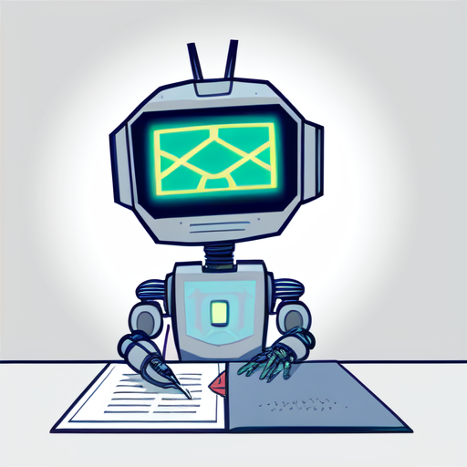
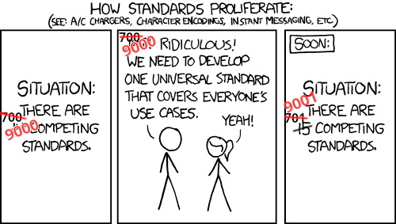

# Transpilation

In this repository, we investigate different aspects and solution (ideas) to the problem of having too many programming languages.



- [Problem](#Problem)
	- [Examples](#Examples)
- [Goal](#Goal)
- [Related Work](#related-work)
	- [Program Equivalence](#program-equivalence)
		- [Translation Validation](#translation-validation)
		- [Program Translation](#program-translation)
	- [Synthesis](#Synthesis)
	- [Artificial Intelligence](#artificial-intelligence)
	- [Transpilers](#Transpilers)
	- [Related Concepts](#related-concepts)
- [Ideas](#Ideas)


## Problem

```
TLDR: There are features bound to programming languages that are conceptually independent of the concrete language used.

With over 9000 programming languages in use, porting these tools by hand to all popular languages is infeasible.

In conclusion, this leads to unncessesary work and unavailability of tools.
```


There are a lot (current estimate >9000) of programming languages (at least 1000 with some hundret of active use and possible many more -- there are at least 3570 registered esoteric programming languages).

Not every language is the same.
We will focus on general-use programming languages (either by design or by use) and ignore special use programming languages.
For these languages we can find multiple similiarities and diference.

There are many aspects to languages (non-exclusive) (I only give one or two examples per class -- many languages are omitted):
* dependent type systems (Gallina, Idris)
* functional programming (Haskell, OCaml)
* imperative (C++)
* object oriented (Java)
* dynamically typed (python, javascript)
* array programming (APL, Fortran)
* low-level (C, Rust)
* Lisp
* prototype (Lua)
* scripting (python, lua)
* concurrent (Rust)
* logical (prolog)
* ....
And many more paradigms can be found on [Wikipedia](https://en.wikipedia.org/wiki/Programming_paradigm).


There are good (my opinion) reasons to use different languages:
* features suited for a special use case
    * low level memory control
    * fully manages memory 
* incompatible features that you like
    * imperative scripting
    * dependent type systems
    * pure functional programming
    * simplicity (depedent on special cases -> maybe consider staging)
    * complexity (depedent on special cases -> maybe consider staging)
* design around special use case (not just primitives)
**Note**: Many of these reasons could be summarized with the debate about static vs dynamic typing, functional vs imperative, dependent vs non-dependent types. And the complexity of specifying implicit assumption. This is an area that warrants improvement. However, it will not be our focus here.

There are also not so good (my opinion) reasons:
* Tools available for this language
    * Analyzers
    * IDEs
    * Libraries
    * Frameworks
    * Standard library functions
* Compiler
    * Speed
    * Optimizations
* Userbase
* Language Primitives

I am not saying, it is wrong to choose a language by any of the second set of points.
However, I propose that these point do not have to / should not influence the choice of language.
On a more abstract level, these points can (for the most part) be isolated from the language itself.
They are only linked by implementation to a language but not conceptually as they apply to programming itself.
In the end, a programming language is only a tool to express semantics of a procedure manipulating data. How we express this can differ in syntax but is conceptually the same.

Even though the syntax might look quite different between languages,
an experienced programmer can pick up any language fast with only a few examples.
They will tell you that the underlying principles between most languages are the same.
A for loop in C is the same as in Java or Python. 
The `map` function of Haskell, the `.map` in Java, the for loop in C, and the list comprehension in Python all look different but express the same semantics.
A while loop and a tail recursive function are quite different in appearance, but every undergrad student learns that they function the same and result in very similar assembly code. 

Despite these similarities or due to the freedom of expression, many languages developed and are in use.
It is good that you can freely choose how you want to write code.
However, it is a shame when tools are locked to a language or need time-intensive ports and re-implementations.



### Examples

Only to name a few examples, we can look at common libraries:

[**Tensorflow**](https://www.tensorflow.org/) and [**PyTorch**](https://pytorch.org/) are widely used and very successful machine-learning tools.
There exist many (one for every popular language) implementations of the frameworks that effectively call the underlying C libraries. Some languages have more sophisticated libraries that embed the frameworks as DSL / reify parts of the language into the frameworks.
Additionally, some languages have libraries building up on the basic frameworks.
Python has one of the best supports for these frameworks.

It is tedious and schematic to write all the boilerplate to call the libraries.
Some language pairs have semi-automation to generate ABI/FFI. 
But these tools only help for special cases and do not solve the problem in general.
The additional problem of advanced interfaces and libraries are currently not solved.

One could even argue, that for many applications the framework itself could be an implementation-detail: The programmer wants to express a ML-model. The details could be hidden by a common interface. There are libraries available that do this. However, it is imaginable that such an interface could be infered automatically and translate between both libraries without human interaction.

The [**QuickCheck**](https://en.wikipedia.org/wiki/QuickCheck) framework is a popular combinator library that helps in generating test cases.
It originates in Haskell and was sucessfully applied to other languages as well.
There is QuickChick in Coq, Hypothesis in Python, based on Hypothesis there is PropTest in Rust, and there are 60 more **re**-implementations in other languages.
To be more precise, there are at least six quickcheck re-implementations for python on Github with at least 15 stars.
Some of these re-implementation "only" support random test generation while others are more fully features including features like test minimization.

Before quickchick was re-implemented, the default way was to write the code, expose a FFI and use quickchick externally by hand.

Another common example are **SQL** frameworks that are re-implemented in every language. More sophisticated features like syntax checking, dummy data generation, compile time checking, ... are left on the way and are only available in very few languages.


To give a last example, [**SOSML**](https://sosml.org/) is an online interpreter for Standard ML with a nice interface.
The SML implementation is written from scratch by students.
However, Saarland University switched from SML to OCaml.
Theoretically, the difference between SML and OCaml are just some renamings.

But the correct handling of these changes either require a transpiler between OCaml and SML (including a parser for OCaml) or changes in the SML interpreter (required in-depth knowledge of the code). See [SOOCaml](https://github.com/NeuralCoder3/SOOCaml-frontend) for a discussion.

This is tedious and could theoretically be automated.
However, until somebody takes time to deeply understand the interpreter, the current solution is to abandon SOSML or to patch in a third-party OCaml interpreter (transpiled to Javascript).


## Goal 

There are multiple concrete goals.
But abstractly, we want to bridge the gap between languages.
To this end, it should be possible to use one languages tools, features, and libraries in another language.

More concretely, we want to develop an universal transpiler (or parts thereof).


There are multiple conceptual paths to attack the problem.
Each path offers multiple ways to achieve the goal.

Before we will look closer at ideas, we focus on related work in the field.
We first introduce the works shallowly and go in-depth in the corresponding idea files.

## Related Work

We collect interesting papers in the related areas of this work.

### Program Equivalence
An important part in the translation is the equivalence of the original and translated program.
This equivalence either guides the translation/synthesis or has to be established alongside/after the translation.

- [Generative Language Modeling for Automated Theorem Proving](https://arxiv.org/pdf/2009.03393.pdf)
- [Program Equivalence](https://drops.dagstuhl.de/opus/volltexte/2018/9758/pdf/dagrep_v008_i004_p001_18151.pdf)
- [Interaction Trees](https://arxiv.org/pdf/1906.00046.pdf)
CompCert
[add from folder]

#### Translation Validation
Translation Validation is a special subfield that focuses on automated equivalence checks of programs before and after optimizations.

- [End-to-End Translation Validation for the Halide Langauge](https://hal.inria.fr/hal-03653857/document)
- [Alive2: Bounded Translation Validation for LLVM](https://dl.acm.org/doi/pdf/10.1145/3453483.3454030)
- [Counterexample-Guided Correlation Algorithm for Translation Validation](https://shubhani.compiler.ai/pubs/oopsla20.pdf)

#### Program Translation
Automated program translations like superoptimizers have to guarantee program equivalence (usually in one language). Superoptimizers are often restricted to loop-free short code segments.

- [Suoper: A Synthesizing Superoptimizer](https://arxiv.org/abs/1711.04422)

[add from folder]

### Synthesis
The target program has to be synthesized from the original program.
The programs need to be equivalent and can be quite complex involving complicated control flow.
However, the synthesis has a clear guideline as the shape of the original program can be used and the semantics of the result is fully defined. 

- [CounterExample-Guided Inductive Synthesis (CEGIS)](https://www-cs.stanford.edu/~preiner/publications/2017/PreinerNiemetzBiere-TACAS17.pdf)
- [Synthesis of Loop-free Programs](https://dl.acm.org/doi/pdf/10.1145/1993316.1993506)
- [Program Synthesis](https://www.nowpublishers.com/article/Details/PGL-010)
- Cyclic Program Synthesis
- [Bottom-Up Synthesis of Recursive Functional Programs using Angelic Execution](https://dl.acm.org/doi/pdf/10.1145/3498682)
- [Evaluating Large Language Models Trained on Code](https://arxiv.org/pdf/2107.03374.pdf)
- [APIfix: Output-Oriented Program Synthesis for Combating Breaking Changes in Libraries](https://gaoxiang9430.github.io/papers/APIFix.pdf)
- [FlashFill++: Scaling Programming by Example by Cutting to the Chase](https://www.microsoft.com/en-us/research/uploads/prod/2022/12/flashfillpp-popl-23-camera-ready.pdf)
- Inductive Synthesis of Structurally Recursive Functional Programs from Non-recursive Expressions
- [Top-Down Synthesis For Library Learning](https://arxiv.org/pdf/2211.16605.pdf)
- Bootstrapping Library-Based Synthesis
- [Abstract Syntax Networks for Code Generation and Semantic Parsing](https://arxiv.org/pdf/1704.07535.pdf)
    - [Github](https://github.com/xiye17/torchASN)
- [Synthesizing an Instruction Selection Rule Library from Semantic Specifications](https://pp.ipd.kit.edu/uploads/publikationen/buchwald18cgo.pdf)

[add from folder]

### Artificial Intelligence
A promising approach is neural-guided synthesis using artificial intelligence for translation.
These tools have been proven to be capable of synthesizing complex code with acceptable accuracy.
However, the current projects mainly look into natural language and do not establish thight guarantees like formal semantics of the output.

- [Competition-Level Code Generation with AlphaCode](https://www.datascienceassn.org/sites/default/files/Competition-Level%20Code%20Generation%20with%20AlphaCode.pdf)
- [CrossBeam: Learning To Search in Bottom-Up Program Synthesis](https://arxiv.org/pdf/2203.10452.pdf)
- [Formal Mathematics Statement Curriculum Learning](https://arxiv.org/pdf/2202.01344.pdf)
- [OpenAI Codex](https://beta.openai.com/docs/guides/code/best-practices)
- [ChatGPT](https://chat.openai.com/chat)
- [Salesforce CodeT5](https://arxiv.org/abs/2109.00859) ([Github](https://github.com/salesforce/CodeT5))
- [Github CoPilot](https://github.com/features/copilot)
- [Transformer models: an introduction and catalog](https://arxiv.org/pdf/2302.07730.pdf)

### Transpilers
Transpilers are mainly written by hand and are far from perfect.
The produced code is not always readable and sometimes needs post-processing.
However, there are often formal (or implicit) guarantees that the result agrees with the original program.

- [A General Purpose Transpiler for Fully Homomorphic Ecryption](https://arxiv.org/pdf/2106.07893.pdf)
- [Interlanguage Migration: From Scripts to Programs](https://dl.acm.org/doi/pdf/10.1145/1176617.1176755)
- [Improving mobile app development using transpilers with maintainable outputs](https://dl.acm.org/doi/pdf/10.1145/3422392.3422426)
- [Automated Transpilation of Imperative to Functional Code using Neural-Guided Program Synthesis (Extended Version)](https://arxiv.org/pdf/2203.09452.pdf)
- [A Simple Abstraction of Arrays and Maps by Program Translation](https://arxiv.org/pdf/1506.04161.pdf)
- [Unsupervised Translation of Programming Languages](https://proceedings.neurips.cc/paper/2020/file/ed23fbf18c2cd35f8c7f8de44f85c08d-Paper.pdf)
- [Pandoc](https://pandoc.org/)
- Popular Media
    - [Legacy Code Conversion - Computerphile](https://www.youtube.com/watch?v=Xz06zYlQrck)

### Related Concepts
- Synthesis
    - Neural(-guided) synthesis
    - Top-Down synthesis
    - Search/Planning
- Program Equivalence
    - Translation Validation
    - Separation Logic
    - symbolic abstraction
    - smt
- Language Design
    - Program Paradigms
    - Compilation Transpilation
    - Decompilation
    - Staging
    - Metaprogramming
    - DSL
    - ABI/FFI
    - Partial Evaluation
- Tests
    - QA
    - logarithmic types
    - fuzzing
    - specification mining


## Ideas

We present some promising ideas in [./Ideas/](./Ideas/). 
The ideas are not exhaustive.  

### Building Blocks

**Transformers**: LLM are currently shown to be knowledgable in complicated synthesis tasks.
The unsupervised trained models present a grasp of related concepts like the relation between natural language and programming languages or between programming languages.
Recent papers and projects have shown first successes in using text transformers to synthesize programs. A more refined and verified approach could build upon this preliminary success.

**Counter Example Guided Synthesis**: Counterexamples contradicting the synthesis specification can be used to refine and guide the search to a solution. These counterexamples can be obtained using SMT solvers or fuzzers.

**Tests**: We can employ automated tests/symbolic abstraction to find program equivalence contradiction. These can be used to refine the result and to ensure trust in a unverified result. This way, we can harvest the power of neural networks without suffering from the unpredictable/unverified nature of neural networks.

**Search**: Many parts of the approach involve/can be formulated as search problems.
For instance the construction (synthesis) of the resulting program can be seen as a search for a valid program with the same properties.
The search has to be heavily pruned and possibly (neural-)guided either directly or via heuristics. A common approach in recent research is to use beam search. There are papers that use bottom-up search as well as other papers that use a top-down approach.

**Latent Representation**: The neural guided approaches can attach to the approach at different levels. Either as guide, as main component, as checked assistant, ... .
In any way, we need to find a suitable way to communicate and represent the data we present to the networks. 
This can happen as simple text (as shown effective by LLM) or using more informative and sophisticated datastructures like graph nets or AST network structures.
Historically more complicated structures did not provide better performance. But recent research showed a more focused network leading to better performance with less resource consumption.

**Partial Eval**: One could build on refined and optimized futamura projects to transpile programs in languages supporting partial evaluation (beta reduction and propagation) that implement corresponding interpreters/compilers. A lingua franca of programming (like in pandas or FFI communication) could make this approach feasible and also help in other approaches.

**Rewrite Rules**: Classically, transpilers operate in declarative programming languages (prolog) using rewrite rules. One idea could be to semi-automatically synthesize these rules.
The approach would be limited to match-rule-based rewriting but would allow for more interaction and control. It would especially be open to formal verification. 

**ABI/FFI**: A unrelated concept to increase interoperability is to make it easier to call functions from other languages. This can happen at different abstraction level.
The functions can be linked at the language level, at C level, at assembly level.
The link can happen statically as foreign function using a FFI or by transpilation or
at runtime using communication bridges.
The function needs a common interface between both languages. This can be as simple
as the standard FFI interface, a JSON bridge, or a universal communication language.
_Related Projects_: APIFix, [DSL Project Github](https://github.com/NeuralCoder3/thorin-dsl)

### Concrete Ideas

We can group the ideas in the following categories:
* Interoperability
* Program Transpilation

[Ideas/NeuralTransformer](Ideas/NeuralTransformer): A promising but simple approach is to use unsupervised trained neural text transformers. These LLM (large language model) presented knowledge about many languages and their (intuitive) semantics (connection to other languages including natural language). The idea in this approach is to synthesize the resulting program and refine it stepwise using (automated) feedback.

[see presentation]

## Applications

Here, we collect (more) concrete ideas for applications of our approaches:
* 


